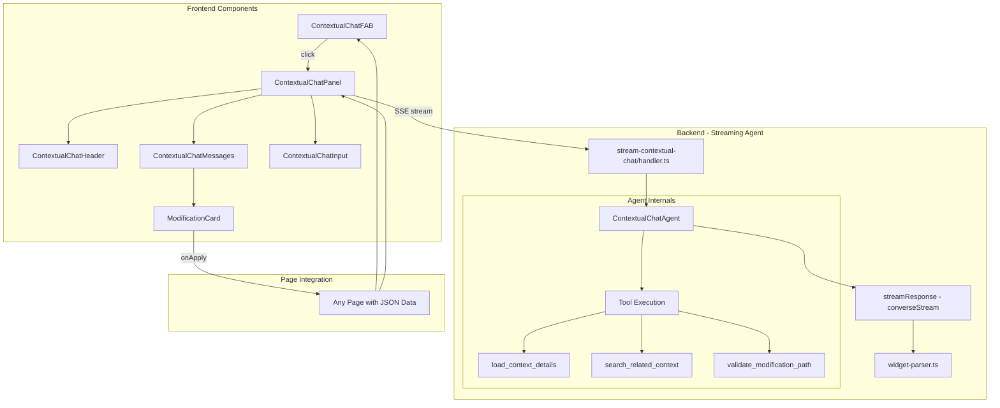

# Contextual Coach Chat Panel - Implementation Specification

## Overview

Build a reusable slide-out chat panel that allows users to have contextual conversations with their AI coach about any page/data structure they're viewing. The panel slides in from the right side of the screen, maintaining visibility of the underlying page content while enabling rich, interactive conversations.

This is the foundation for a platform-wide pattern where users can chat with their coach about any data structure (programs, workouts, progress, settings) without leaving the page they're on.

## Design Philosophy

- **Contextual, not modal**: User stays on current page, chat appears alongside
- **Simple but not basic**: Clean interface with powerful inline widgets
- **Repeatable pattern**: Build once as a generic component, use across all pages
- **NeonPanda brand**: Synthwave aesthetic with cyan/purple neon accents
- **Agent-based architecture**: Uses the established AI agent pattern from `libs/agents/` for consistency

---

## Architecture

### Agent-Based Streaming Pattern

This implementation uses a **hybrid agent-streaming architecture** that combines:

1. **Agent pattern** for context gathering and tool orchestration (consistent with `ProgramDesignerAgent`)
2. **SSE streaming** for real-time response delivery (consistent with `stream-coach-conversation`)



### Why Agent Pattern?

The existing `stream-coach-conversation` Lambda works well for general chat but lacks:

- **Tool orchestration** - No ability for AI to call tools mid-conversation
- **Context retrieval** - Can't dynamically fetch additional data based on user questions
- **Validation** - No structured way to validate proposed modifications

By using the agent pattern from `libs/agents/`, the contextual chat gains:

1. **Consistency** with `ProgramDesignerAgent`, `WorkoutLoggerAgent`, `CoachCreatorAgent`
2. **Tool execution loop** - AI can decide when to query Pinecone, load additional context, etc.
3. **Structured tool results** - Tools can store results for later use
4. **Extensibility** - Easy to add new tools (e.g., `apply_modification`, `query_user_history`)

### Streaming Hybrid Approach

The challenge: agent pattern is non-streaming, but we need real-time UX.

**Solution**: Two-phase execution within a single streaming handler:

```
Phase 1: Context Gathering (non-streaming)
├── Agent runs tool loop if needed
├── Gathers context, validates paths, retrieves related data
└── Returns: enriched context for response generation

Phase 2: Response Streaming (SSE)
├── Build system prompt with gathered context
├── Stream AI response via converseStream
├── Parse widgets/suggestions from complete response
└── Yield: chunks → widgets → suggestions → complete
```

This mirrors the "Smart Router" pattern in `stream-coach-conversation` where a quick analysis happens before streaming begins.

### Visual Reference

```
┌───────────────────────────────────┬─────────────────────────┐
│                                   │  ┌─────────────────┐    │
│                                   │  │ Coach Header    │    │
│                                   │  │ Context Badge   │    │
│       Main Page Content           │  ├─────────────────┤    │
│       (Training Program)          │  │                 │    │
│                                   │  │ Chat Messages   │    │
│       Still visible and           │  │ + Widgets       │    │
│       interactive                 │  │                 │    │
│                                   │  ├─────────────────┤    │
│                                   │  │ Suggestion Chips│    │
│                                   │  ├─────────────────┤    │
│                                   │  │ Input Field     │    │
│                                   │  └─────────────────┘    │
└───────────────────────────────────┴─────────────────────────┘
```

### Key Design Decisions

1. **Slide-out panel** - 384px wide (`w-96`) on desktop, full-width on mobile, overlays content without navigating away
2. **Agent-based backend** - Uses `ContextualChatAgent` extending `Agent<ContextualChatContext>` for consistency with `ProgramDesignerAgent`, `WorkoutLoggerAgent`, and `CoachCreatorAgent`
3. **Hybrid streaming** - Agent tools run non-streaming for context gathering, then final response streams via `converseStream`
4. **Lambda Function URL** - Uses Function URL for streaming (NOT API Gateway), same pattern as existing `streamCoachConversation`
5. **Widget parsing on complete** - Widgets are parsed from the COMPLETE AI response, not during streaming. Text streams in real-time, then widgets are extracted and rendered after.
6. **Conversation history in state** - Full conversation history is managed in React state and sent with each request. No server-side session storage for V1.
7. **Reusable pattern** - Generic `contextType`/`contextData` props work with any data structure
8. **Tool-based context enrichment** - Agent can dynamically query Pinecone, load additional context, validate modification paths

### Key UI Elements

1. **Floating Action Button (FAB)** - Gradient cyan-to-purple, opens panel
   - **Desktop**: `bottom-6 right-6` (standard position)
   - **Mobile**: `bottom-[160px] right-6` (above `QuickActionsFAB` which is at `bottom: calc(80px + safe-area)`)
2. **Slide-out Panel** - 384px wide, slides from right with semi-transparent overlay behind
3. **Coach Header** - Avatar, name, green status dot, context indicator ("Viewing: Program Name")
4. **Context Badge** - Purple background strip below header, shows what data the coach can see
5. **Message Stream** - Coach messages left-aligned with avatar, user messages right-aligned
6. **Inline Widgets** - Modification cards rendered AFTER the text content of a message
7. **Suggestion Chips** - Horizontal scrollable quick actions above input
8. **Input Area** - Textarea with send button, Enter to send, Shift+Enter for newline

### Mobile Considerations

**FAB Positioning Conflict:**
The existing `QuickActionsFAB` (`src/components/navigation/QuickActionsFAB.jsx`) is positioned at:

- `bottom: calc(80px + env(safe-area-inset-bottom))` (above 64px bottom nav)
- `right-6`, `z-50`
- Only visible on mobile (`md:hidden`)

The contextual chat FAB must avoid this conflict:

- **Mobile**: Position at `bottom-[160px]` (above QuickActionsFAB) with `md:bottom-6`
- **Hide when QuickActionsFAB is expanded**: Check `isMoreMenuOpen` from `NavigationContext`
- **Alternative**: Hide QuickActionsFAB when on ProgramDashboard page (context-specific)

**Panel Layout:**

- Full-width on mobile (`w-full lg:w-96`)
- Panel covers entire screen on mobile (no partial overlay)
- Input area respects keyboard with `pb-safe` and viewport units
- Close button in header is touch-friendly (44x44 minimum)

**Touch Interactions:**

- Swipe-to-close gesture on panel (future enhancement)
- Long-press on suggestion chips for preview (future enhancement)
- Haptic feedback on FAB press (use `triggerHaptic()` from navigation utils)

---

## Naming Conventions

Follow project conventions from `AGENTS.md`:

```typescript
// camelCase for identifiers (not acronyms)
const contextualChatAgent = new ContextualChatAgent(); // ✓
const contextualChatURL = "..."; // ✗ (should be contextualChatUrl)

// Full descriptive names
loadContextDetails; // ✓
loadCtxDtls; // ✗

// Constants for string literals
CONTEXT_TYPES.PROGRAM; // ✓
("program"); // ✗ (use constant)

// Entity IDs
const widgetId = `widget_${Date.now()}_${shortId()}`; // ✓
```

---

## Files Summary

### New Files (18)

**Backend - Agent (5 files):**

| File                                                       | Purpose                                                                                                                   |
| ---------------------------------------------------------- | ------------------------------------------------------------------------------------------------------------------------- |
| `amplify/functions/libs/agents/contextual-chat/agent.ts`   | `ContextualChatAgent` class extending base `Agent`                                                                        |
| `amplify/functions/libs/agents/contextual-chat/types.ts`   | `ContextualChatContext`, `ContextualChatResult`, `Widget` interfaces                                                      |
| `amplify/functions/libs/agents/contextual-chat/prompts.ts` | System prompt builder with widget/suggestion formatting                                                                   |
| `amplify/functions/libs/agents/contextual-chat/tools.ts`   | Agent tools: `load_context_details`, `load_program_with_workouts`, `search_related_context`, `validate_modification_path` |
| `amplify/functions/libs/agents/contextual-chat/helpers.ts` | Context condensation, widget parsing, `STORAGE_KEY_MAP`                                                                   |

**Backend - Lambda (3 files):**

| File                                                      | Purpose                                              |
| --------------------------------------------------------- | ---------------------------------------------------- |
| `amplify/functions/stream-contextual-chat/handler.ts`     | Streaming Lambda handler using `ContextualChatAgent` |
| `amplify/functions/stream-contextual-chat/resource.ts`    | Lambda resource definition                           |
| `amplify/functions/apply-program-modification/handler.ts` | API to apply modifications to DynamoDB/S3            |

**Backend - Utilities (1 file):**

| File                                     | Purpose                                      |
| ---------------------------------------- | -------------------------------------------- |
| `amplify/functions/libs/object-utils.ts` | `setValueByPath`, `getValueByPath` utilities |

**Frontend (9 files):**

| File                                               | Purpose                                              |
| -------------------------------------------------- | ---------------------------------------------------- |
| `src/components/chat/ContextualChatPanel.jsx`      | Main panel container (reusable)                      |
| `src/components/chat/ContextualChatFAB.jsx`        | Floating action button (mobile-aware positioning)    |
| `src/components/chat/ContextualChatHeader.jsx`     | Coach info + context display                         |
| `src/components/chat/ContextualChatMessages.jsx`   | Message list with streaming + widgets                |
| `src/components/chat/ContextualChatInput.jsx`      | Input area with suggestion chips                     |
| `src/components/chat/widgets/ModificationCard.jsx` | Proposed change widget                               |
| `src/utils/apis/contextualChatApi.js`              | API wrapper for SSE streaming                        |
| `src/utils/apis/programApi.js`                     | `applyProgramModification`, `getProgramWithWorkouts` |
| `src/utils/helpers/pathUpdate.js`                  | `setValueByPath`, `getValueByPath` utilities         |

### Modified Files (3)

| File                                           | Change                                                |
| ---------------------------------------------- | ----------------------------------------------------- |
| `amplify/backend.ts`                           | Register Lambda, attach policies, create Function URL |
| `amplify/api/resource.ts`                      | Add route for `apply-program-modification`            |
| `src/components/programs/ProgramDashboard.jsx` | Add FAB + Panel integration                           |

### Optional Modifications

| File                                                  | Change                                                 |
| ----------------------------------------------------- | ------------------------------------------------------ |
| `src/utils/ui/uiPatterns.js`                          | Add `contextualChatFab` pattern for consistent styling |
| `amplify/functions/libs/contextual-chat/constants.ts` | Add `CONTEXT_TYPES` constant                           |

---

## Existing APIs Reference

### DynamoDB Operations (`amplify/dynamodb/program.ts`)

```typescript
// Get program metadata
import {
  getProgram,
  updateProgram,
  queryPrograms,
} from "../../dynamodb/operations";

const program = await getProgram(userId, coachId, programId);

// Partial update with deepMerge (preserves nested properties)
const updatedProgram = await updateProgram(userId, coachId, programId, {
  "phases[0].name": "Updated Phase Name", // Note: path updates not directly supported
  description: "New description", // Top-level updates work
});
```

### S3 Operations (`amplify/functions/libs/program/s3-utils.ts`)

```typescript
import {
  getProgramDetailsFromS3,
  saveProgramDetailsToS3,
  updateWorkoutInS3,
  getWorkoutFromS3,
} from "../../program/s3-utils";

// Get full workout templates
const programDetails = await getProgramDetailsFromS3(program.s3DetailKey);
const workoutTemplates = programDetails.workoutTemplates;

// Update entire program details (new key generated)
const newS3Key = await saveProgramDetailsToS3(s3Key, updatedProgramDetails);

// Update specific workout by day number
const newS3Key = await updateWorkoutInS3(s3Key, dayNumber, { duration: 45 });
```

### New APIs Needed

**1. `updateProgramByPath()` - Update nested program fields**

```typescript
// New function in amplify/dynamodb/program.ts
export async function updateProgramByPath(
  userId: string,
  coachId: string,
  programId: string,
  targetPath: string,
  newValue: any,
): Promise<Program> {
  const program = await getProgram(userId, coachId, programId);
  if (!program) throw new Error("Program not found");

  // Apply path update using setValueByPath utility
  const updatedProgram = setValueByPath(program, targetPath, newValue);

  // Save and return
  await saveProgram(updatedProgram);
  return updatedProgram;
}
```

**2. `updateWorkoutTemplateByPath()` - Update workout template fields in S3**

```typescript
// New function in amplify/functions/libs/program/s3-utils.ts
export async function updateWorkoutTemplateByPath(
  s3Key: string,
  templateId: string,
  targetPath: string,
  newValue: any,
): Promise<string> {
  const programDetails = await getProgramDetailsFromS3(s3Key);
  if (!programDetails) throw new Error("Program details not found");

  const templateIndex = programDetails.workoutTemplates.findIndex(
    (t) => t.templateId === templateId,
  );
  if (templateIndex === -1) throw new Error("Template not found");

  // Apply path update
  programDetails.workoutTemplates[templateIndex] = setValueByPath(
    programDetails.workoutTemplates[templateIndex],
    targetPath,
    newValue,
  );

  return await saveProgramDetailsToS3(s3Key, programDetails);
}
```

---

## Phase 1: Backend - Agent Implementation (Day 1)

### 1.1 Create Constants

**File:** `amplify/functions/libs/agents/contextual-chat/constants.ts`

Following project convention of using constants for string literals:

```typescript
/**
 * Contextual Chat Constants
 *
 * Use these constants instead of string literals throughout the codebase.
 */

/**
 * Context types that the contextual chat can work with
 */
export const CONTEXT_TYPES = {
  PROGRAM: "program",
  WORKOUT: "workout",
  ANALYTICS: "analytics",
  COACH: "coach",
  CHECKIN: "checkin",
} as const;

export type ContextType = (typeof CONTEXT_TYPES)[keyof typeof CONTEXT_TYPES];

/**
 * Widget types for inline modifications
 */
export const WIDGET_TYPES = {
  MODIFICATION: "modification",
} as const;

export type WidgetType = (typeof WIDGET_TYPES)[keyof typeof WIDGET_TYPES];

/**
 * Widget status values
 */
export const WIDGET_STATUS = {
  PENDING: "pending",
  APPLIED: "applied",
  REJECTED: "rejected",
} as const;

export type WidgetStatus = (typeof WIDGET_STATUS)[keyof typeof WIDGET_STATUS];

/**
 * SSE event types
 */
export const SSE_EVENT_TYPES = {
  START: "start",
  CHUNK: "chunk",
  CONTEXTUAL: "contextual",
  WIDGET: "widget",
  SUGGESTIONS: "suggestions",
  COMPLETE: "complete",
  ERROR: "error",
} as const;

/**
 * Tool result storage keys (semantic mapping)
 */
export const STORAGE_KEYS = {
  CONTEXT_DETAILS: "context_details",
  PROGRAM_WITH_WORKOUTS: "program_with_workouts",
  RELATED_CONTEXT: "related_context",
  PATH_VALIDATION: "path_validation",
} as const;
```

### 1.2 Create Agent Types

**File:** `amplify/functions/libs/agents/contextual-chat/types.ts`

**Reference:** `amplify/functions/libs/agents/program-designer/types.ts`

```typescript
/**
 * Contextual Chat Agent Types
 *
 * Follows the established agent pattern from ProgramDesignerAgent.
 */

import type { AgentContext } from "../core/types";
import {
  CONTEXT_TYPES,
  WIDGET_TYPES,
  WIDGET_STATUS,
  type ContextType,
  type WidgetType,
  type WidgetStatus,
} from "./constants";

// Re-export constants for convenience
export { CONTEXT_TYPES, WIDGET_TYPES, WIDGET_STATUS };
export type { ContextType, WidgetType, WidgetStatus };

export interface ContextualChatContext extends AgentContext {
  userId: string;
  coachId: string;
  contextType: ContextType;
  contextId: string;
  contextData: Record<string, any>;
  conversationHistory: ConversationMessage[];
}

export interface ConversationMessage {
  role: "user" | "assistant";
  content: string;
}

export interface ContextualChatResult {
  success: boolean;
  response: string;
  widgets: Widget[];
  suggestions: string[];
  enrichedContext?: Record<string, any>;
  error?: string;
}

export interface Widget {
  id: string;
  type: WidgetType;
  status: WidgetStatus;
  data: ModificationData;
}

export interface ModificationData {
  targetPath: string;
  before: string;
  after: string;
  reasoning: string;
}
```

### 1.3 Create Agent Tools

**File:** `amplify/functions/libs/agents/contextual-chat/tools.ts`

**Reference:** `amplify/functions/libs/agents/program-designer/tools.ts`

#### Tool Result Storage Pattern

Following the pattern from `ProgramDesignerAgent`, use semantic key mapping:

```typescript
/**
 * Semantic storage key mapping for tool results
 * Maps tool IDs to shorter, meaningful keys for cleaner result storage
 */
const STORAGE_KEY_MAP: Record<string, string> = {
  load_context_details: "context_details",
  load_program_with_workouts: "program_with_workouts",
  search_related_context: "related_context",
  validate_modification_path: "path_validation",
};

// Store results via: this.storeToolResult(toolId, result)
// Retrieve via: context.getToolResult?.('context_details')
```

#### Tool Definitions

```typescript
/**
 * Contextual Chat Agent Tools
 *
 * Tools for context enrichment, data loading, and modification validation.
 * Follows patterns from program-designer/tools.ts
 */

import type { Tool } from "../core/types";
import type { ContextualChatContext } from "./types";
import {
  getCoachConfig,
  getUserProfile,
  getProgram,
} from "../../../../dynamodb/operations";
import { getProgramDetailsFromS3 } from "../../program/s3-utils";
import { queryPineconeContext } from "../../api-helpers";

/**
 * Tool 1: Load Context Details
 *
 * Loads coach configuration and user profile for personalized responses.
 * ALWAYS CALLED FIRST to establish conversation context.
 */
export const loadContextDetailsTool: Tool<ContextualChatContext> = {
  id: "load_context_details",
  description: `Load coach configuration and user profile for personalized responses.
CALL THIS FIRST in every conversation to establish context.

Returns: coachConfig, userProfile, contextValidation`,

  inputSchema: {
    type: "object",
    properties: {
      userId: { type: "string", description: "User ID" },
      coachId: { type: "string", description: "Coach ID" },
    },
    required: ["userId", "coachId"],
  },

  async execute(input: any, context: ContextualChatContext) {
    console.info("📥 Executing load_context_details tool");

    const [coachConfig, userProfile] = await Promise.all([
      getCoachConfig(input.userId, input.coachId),
      getUserProfile(input.userId),
    ]);

    if (!coachConfig) {
      throw new Error(`Coach config not found for coachId: ${input.coachId}`);
    }

    console.info("✅ Context details loaded:", {
      coachName: coachConfig.coach_name,
      hasUserProfile: !!userProfile,
    });

    return { coachConfig, userProfile };
  },
};

/**
 * Tool 2: Load Program with Workout Templates
 *
 * Loads full program from DynamoDB and workout templates from S3.
 * CALL THIS when user asks about specific workout details, exercises, or scheduling.
 */
export const loadProgramWithWorkoutsTool: Tool<ContextualChatContext> = {
  id: "load_program_with_workouts",
  description: `Load full program metadata from DynamoDB and workout templates from S3.

CALL THIS when user asks about:
- Specific workouts or exercises
- Scheduling or calendar details
- Phase-specific information not in contextData

Note: contextData may be condensed for large programs. Use this tool to get full details.

Returns: program (DynamoDB), workoutTemplates (S3), programDetails`,

  inputSchema: {
    type: "object",
    properties: {
      programId: { type: "string", description: "Program ID to load" },
    },
    required: ["programId"],
  },

  async execute(input: any, context: ContextualChatContext) {
    console.info("📥 Executing load_program_with_workouts tool:", {
      programId: input.programId,
    });

    // Load program from DynamoDB
    const program = await getProgram(
      context.userId,
      context.coachId,
      input.programId,
    );

    if (!program) {
      throw new Error(`Program not found: ${input.programId}`);
    }

    // Load workout templates from S3 if available
    let workoutTemplates = [];
    let programDetails = null;

    if (program.s3DetailKey) {
      programDetails = await getProgramDetailsFromS3(program.s3DetailKey);
      workoutTemplates = programDetails?.workoutTemplates || [];
    }

    console.info("✅ Program with workouts loaded:", {
      programId: program.programId,
      programName: program.name,
      phaseCount: program.phases?.length,
      workoutCount: workoutTemplates.length,
      hasS3Details: !!programDetails,
    });

    return {
      program,
      workoutTemplates,
      programDetails,
    };
  },
};

/**
 * Tool 3: Search Related Context
 *
 * Queries Pinecone for related programs, workouts, or user history.
 * CALL when user asks about comparisons, history, or similar items.
 */
export const searchRelatedContextTool: Tool<ContextualChatContext> = {
  id: "search_related_context",
  description: `Search Pinecone for related programs, workouts, or history.

CALL when user asks about:
- Similar programs or workouts
- Their training history
- Comparisons with past work
- Related exercises or methodologies

Returns: matches (array of relevant content with scores)`,

  inputSchema: {
    type: "object",
    properties: {
      query: {
        type: "string",
        description: 'Search query (e.g., "similar strength programs")',
      },
      searchTypes: {
        type: "array",
        items: { type: "string" },
        description:
          "Types to search: workouts, programs, memories, methodologies",
      },
      topK: { type: "number", description: "Number of results (default 5)" },
    },
    required: ["query"],
  },

  async execute(input: any, context: ContextualChatContext) {
    console.info("🔍 Executing search_related_context tool:", {
      query: input.query,
    });

    const searchTypes = input.searchTypes || ["workouts", "programs"];

    const result = await queryPineconeContext(context.userId, input.query, {
      topK: input.topK || 5,
      includeWorkouts: searchTypes.includes("workouts"),
      includePrograms: searchTypes.includes("programs"),
      includeMemories: searchTypes.includes("memories"),
      includeMethodology: searchTypes.includes("methodologies"),
      minScore: 0.7,
    });

    const matches =
      result.success && result.matches
        ? result.matches.map((match: any) => ({
            content: match.content || "",
            type: match.metadata?.type || "unknown",
            score: match.score,
          }))
        : [];

    console.info("✅ Search completed:", { matchCount: matches.length });

    return { matches };
  },
};

/**
 * Tool 4: Validate Modification Path
 *
 * Validates that a path exists in the context data before proposing a modification.
 * CALL THIS before including a widget:modification in your response.
 */
export const validateModificationPathTool: Tool<ContextualChatContext> = {
  id: "validate_modification_path",
  description: `Validate a path exists in context data before proposing a modification.

CALL THIS before including a widget:modification in your response.
This prevents invalid modification proposals.

Returns: isValid, currentValue, pathExists, targetPath`,

  inputSchema: {
    type: "object",
    properties: {
      targetPath: {
        type: "string",
        description:
          'Path to validate (e.g., "phases[0].workouts[2].duration")',
      },
    },
    required: ["targetPath"],
  },

  async execute(input: any, context: ContextualChatContext) {
    console.info("✅ Executing validate_modification_path tool:", {
      path: input.targetPath,
    });

    const { targetPath } = input;
    const pathParts = targetPath.replace(/\[(\d+)\]/g, ".$1").split(".");
    let current: any = context.contextData;
    let pathExists = true;

    for (const part of pathParts) {
      if (current === undefined || current === null) {
        pathExists = false;
        break;
      }
      current = current[part];
    }

    return {
      isValid: pathExists && current !== undefined,
      currentValue: pathExists ? current : null,
      pathExists,
      targetPath,
    };
  },
};

// Export all tools
export const contextualChatTools = [
  loadContextDetailsTool,
  loadProgramWithWorkoutsTool,
  searchRelatedContextTool,
  validateModificationPathTool,
];
```

#### Parallel Tool Execution

Following the pattern from `ProgramDesignerAgent`, tools can be executed in parallel when appropriate:

```typescript
/**
 * Override handleToolUse to implement parallel execution
 * (In ContextualChatAgent class)
 */
protected async handleToolUse(response: any): Promise<void> {
  const contentBlocks = response.output?.message?.content || [];

  // Group tools by type for potential parallelization
  const toolGroups = this.extractAndGroupTools(contentBlocks);

  // Execute independent tools in parallel
  // load_context_details and search_related_context can run in parallel
  const parallelizableTools = ['load_context_details', 'search_related_context'];

  const parallelGroup = [];
  const sequentialGroup = [];

  for (const [toolId, toolCalls] of toolGroups) {
    if (parallelizableTools.includes(toolId)) {
      parallelGroup.push(...toolCalls);
    } else {
      sequentialGroup.push(...toolCalls);
    }
  }

  // Execute parallel tools first
  if (parallelGroup.length > 0) {
    console.info(`🚀 Executing ${parallelGroup.length} tools in parallel`);
    await Promise.all(parallelGroup.map(tc => this.executeTool(tc)));
  }

  // Then sequential tools
  for (const toolCall of sequentialGroup) {
    await this.executeTool(toolCall);
  }
}
```

### 1.4 Create Agent Class

**File:** `amplify/functions/libs/agents/contextual-chat/agent.ts`

**Reference:** `amplify/functions/libs/agents/program-designer/agent.ts`

```typescript
/**
 * Contextual Chat Agent
 *
 * Handles contextual conversations with tool-based context enrichment.
 */

import { Agent } from "../core/agent";
import type { ContextualChatContext, ContextualChatResult } from "./types";
import { contextualChatTools } from "./tools";
import { buildContextualChatPrompt } from "./prompts";
import { parseResponseForWidgets, condenseContextIfNeeded } from "./helpers";
import { MODEL_IDS } from "../../api-helpers";

export class ContextualChatAgent extends Agent<ContextualChatContext> {
  private toolResults: Map<string, any> = new Map();

  constructor(context: ContextualChatContext) {
    const condensedData = condenseContextIfNeeded(
      context.contextData,
      context.contextType,
    );
    const fullPrompt = buildContextualChatPrompt({
      contextType: context.contextType,
      contextData: condensedData,
    });

    super({
      systemPrompt: fullPrompt,
      tools: contextualChatTools,
      modelId: MODEL_IDS.PLANNER_MODEL_FULL,
      context: { ...context, contextData: condensedData },
    });
  }

  async processMessage(userMessage: string): Promise<ContextualChatResult> {
    try {
      const response = await this.converse(userMessage);
      const { cleanText, widgets, suggestions } =
        parseResponseForWidgets(response);

      return {
        success: true,
        response: cleanText,
        widgets,
        suggestions,
        enrichedContext: this.toolResults.get("related_context"),
      };
    } catch (error) {
      return {
        success: false,
        response: "",
        widgets: [],
        suggestions: [],
        error: error instanceof Error ? error.message : "Unknown error",
      };
    }
  }

  getContextDetails() {
    return this.toolResults.get("context_details");
  }
}
```

### 1.5 Create Streaming Lambda Handler

**File:** `amplify/functions/stream-contextual-chat/handler.ts`

**Reference:** `amplify/functions/stream-coach-conversation/handler.ts` + `amplify/functions/build-program/handler.ts`

**Request Shape:**

```typescript
interface ContextualChatRequest {
  userId: string;
  coachId: string;
  contextType: "program" | "workout" | "analytics" | "coach" | "checkin";
  contextId: string;
  contextData: Record<string, any>;
  message: string;
  conversationHistory: Array<{ role: "user" | "assistant"; content: string }>;
}
```

**Hybrid Handler Flow:**

```typescript
/**
 * Stream Contextual Chat Lambda Handler
 *
 * Hybrid approach combining:
 * - Agent pattern for context gathering (non-streaming)
 * - SSE streaming for real-time response delivery
 */

import type { Context } from "aws-lambda";
import { Readable } from "stream";
import { promisify } from "util";
const pipeline = promisify(require("stream").pipeline);

import { withStreamingAuth } from "../libs/auth/middleware";
import {
  formatStartEvent,
  formatChunkEvent,
  formatContextualEvent,
  formatCompleteEvent,
} from "../libs/streaming";
import { ContextualChatAgent } from "../libs/agents/contextual-chat/agent";
import { buildContextualChatPrompt } from "../libs/agents/contextual-chat/prompts";
import { parseResponseForWidgets } from "../libs/agents/contextual-chat/helpers";
import { generateAIResponseStream } from "../libs/coach-conversation/response-orchestrator";

// Custom SSE event formatters
const formatWidgetEvent = (widget: any) =>
  `data: ${JSON.stringify({ type: "widget", widget })}\n\n`;
const formatSuggestionsEvent = (suggestions: string[]) =>
  `data: ${JSON.stringify({ type: "suggestions", suggestions })}\n\n`;

const internalHandler = async (event, responseStream, context) => {
  const eventGenerator = createEventStream(event);
  await pipeline(Readable.from(eventGenerator), responseStream);
  context.callbackWaitsForEmptyEventLoop = false;
};

async function* createEventStream(event) {
  yield formatStartEvent();

  const body = JSON.parse(event.body || "{}");
  const {
    userId,
    coachId,
    contextType,
    contextId,
    contextData,
    message,
    conversationHistory,
  } = body;

  // Phase 1: Agent gathers context (non-streaming)
  yield formatContextualEvent("Looking at your program...", "analyzing");

  const agent = new ContextualChatAgent({
    userId,
    coachId,
    contextType,
    contextId,
    contextData,
    conversationHistory,
  });

  // Get context details (coach config, user profile)
  const contextDetails =
    agent.getContextDetails() || (await loadContextDirect(userId, coachId));

  // Build system prompt with context
  const systemPrompt = buildContextualChatPrompt({
    coach: contextDetails?.coachConfig,
    contextType,
    contextData,
  });

  // Phase 2: Stream response via converseStream
  yield formatContextualEvent("Thinking about this...", "generating");

  let fullResponse = "";
  const stream = await generateAIResponseStream({
    systemPrompt,
    messages: [...conversationHistory, { role: "user", content: message }],
    coachConfig: contextDetails?.coachConfig,
  });

  for await (const chunk of stream) {
    fullResponse += chunk;
    yield formatChunkEvent(chunk);
  }

  // Phase 3: Parse widgets and suggestions
  const { cleanText, widgets, suggestions } =
    parseResponseForWidgets(fullResponse);

  for (const widget of widgets) {
    yield formatWidgetEvent(widget);
  }

  if (suggestions.length > 0) {
    yield formatSuggestionsEvent(suggestions);
  }

  yield formatCompleteEvent(cleanText);
}

export const handler = awslambda.streamifyResponse(
  withStreamingAuth(internalHandler),
);
```

**SSE Event Types:**

```typescript
// Text chunk during streaming (sent as chunks arrive)
{ type: 'chunk', content: string }

// Widget to render inline (sent after streaming complete)
{ type: 'widget', widget: {
    id: string,
    type: 'modification',
    status: 'pending',
    data: { targetPath, before, after, reasoning }
  }
}

// Suggested follow-up actions (sent after streaming complete)
{ type: 'suggestions', suggestions: string[] }

// Stream complete (sent last)
{ type: 'complete', fullMessage: string }
```

### 1.6 Create Prompt Builder

**File:** `amplify/functions/libs/agents/contextual-chat/prompts.ts`

**Reference:** `amplify/functions/libs/agents/program-designer/prompts.ts`

```typescript
/**
 * Contextual Chat Agent System Prompts
 *
 * Follows the established pattern from program-designer/prompts.ts
 */

import type { ContextType } from "./types";

export function buildContextualChatPrompt({
  coach,
  contextType,
  contextData,
}: {
  coach?: any; // CoachConfig
  contextType: ContextType;
  contextData: Record<string, any>;
}): string {
  const coachName = coach?.coach_name || "Coach";
  const personality = coach?.selected_personality?.primary_template || "";
  const communicationStyle =
    coach?.technical_config?.communication_style || "conversational";

  return `# YOU ARE ${coachName.toUpperCase()}, A FITNESS COACH

${personality ? `## Your Personality\n${personality}\n` : ""}
Communication style: ${communicationStyle}

## YOUR TOOLS

You have access to these tools:
1. **load_context_details** - CALL FIRST to load coach config and user profile
2. **search_related_context** - Search for similar programs/workouts in user history
3. **validate_modification_path** - Validate a path before proposing a modification

## CURRENT CONTEXT

You are helping the user with their ${contextType}. Here is the data structure you can see:

<context_data type="${contextType}">
${JSON.stringify(contextData, null, 2)}
</context_data>

## RESPONSE GUIDELINES

1. Keep responses concise and conversational (2-4 sentences typical)
2. Reference specific details from the context data to show you understand it
3. When the user asks to change something, propose a modification using the widget format below
4. Use your tools when you need additional context or to validate modifications

## WIDGET FORMAT

When suggesting a modification, include this EXACTLY (with the backticks):

\`\`\`widget:modification
{
  "targetPath": "weeks[2].workouts[3].duration",
  "before": "60 min",
  "after": "35 min",
  "reasoning": "Shortened to fit your schedule"
}
\`\`\`

Rules for modifications:
- Use validate_modification_path tool to verify the path exists
- targetPath must be a valid path in the context data
- before must match the current value
- after is the proposed new value
- reasoning explains why this change helps (1 sentence)

## SUGGESTIONS FORMAT

End EVERY response with 2-4 suggested follow-ups:

\`\`\`suggestions
["Show me next week", "Add a rest day", "Why this exercise?"]
\`\`\`

Make suggestions contextually relevant to what was just discussed.
`;
}
```

### 1.7 Create Helpers

**File:** `amplify/functions/libs/agents/contextual-chat/helpers.ts`

````typescript
/**
 * Contextual Chat Agent Helpers
 *
 * Widget parsing, context condensation, storage key mapping, and utility functions.
 */

import { v4 as uuidv4 } from "uuid";
import type { Widget, ContextType } from "./types";
import { WIDGET_TYPES, WIDGET_STATUS, STORAGE_KEYS } from "./constants";

/**
 * Tool result storage key mapping
 * Maps tool IDs to semantic storage keys for cleaner result retrieval
 */
export const STORAGE_KEY_MAP: Record<string, string> = {
  load_context_details: STORAGE_KEYS.CONTEXT_DETAILS,
  load_program_with_workouts: STORAGE_KEYS.PROGRAM_WITH_WORKOUTS,
  search_related_context: STORAGE_KEYS.RELATED_CONTEXT,
  validate_modification_path: STORAGE_KEYS.PATH_VALIDATION,
};

interface ParsedResponse {
  cleanText: string;
  widgets: Widget[];
  suggestions: string[];
}

/**
 * Parse AI response for widgets and suggestions
 *
 * Extracts:
 * - ```widget:modification blocks → Widget[]
 * - ```suggestions blocks → string[]
 *
 * Returns clean text with blocks removed.
 */
export function parseResponseForWidgets(fullResponse: string): ParsedResponse {
  const widgets: Widget[] = [];
  let suggestions: string[] = [];
  let cleanText = fullResponse;

  // Extract modification widgets
  const modificationRegex = /```widget:modification\s*([\s\S]*?)```/g;
  let match;

  while ((match = modificationRegex.exec(fullResponse)) !== null) {
    try {
      const data = JSON.parse(match[1].trim());
      widgets.push({
        id: uuidv4(),
        type: WIDGET_TYPES.MODIFICATION,
        status: WIDGET_STATUS.PENDING,
        data: {
          targetPath: data.targetPath,
          before: String(data.before),
          after: String(data.after),
          reasoning: data.reasoning,
        },
      });
      cleanText = cleanText.replace(match[0], "");
    } catch (e) {
      console.warn("Failed to parse modification widget:", e);
    }
  }

  // Extract suggestions
  const suggestionsRegex = /```suggestions\s*([\s\S]*?)```/g;
  const suggestionsMatch = suggestionsRegex.exec(fullResponse);

  if (suggestionsMatch) {
    try {
      suggestions = JSON.parse(suggestionsMatch[1].trim());
      cleanText = cleanText.replace(suggestionsMatch[0], "");
    } catch (e) {
      console.warn("Failed to parse suggestions:", e);
    }
  }

  cleanText = cleanText.trim().replace(/\n{3,}/g, "\n\n");
  return { cleanText, widgets, suggestions };
}

/**
 * Condense context data if too large (>50KB)
 *
 * Follows pattern from program-designer for context condensation.
 */
export function condenseContextIfNeeded(
  data: Record<string, any>,
  contextType: ContextType,
): Record<string, any> {
  const jsonString = JSON.stringify(data);

  if (jsonString.length < 50000) {
    return data;
  }

  console.info("📦 Condensing context data:", {
    originalSize: jsonString.length,
    contextType,
  });

  if (contextType === "program") {
    const currentWeek = data.currentWeek || 1;
    return {
      programId: data.programId,
      name: data.name,
      status: data.status,
      currentWeek,
      totalWeeks: data.weeks?.length,
      // Include current + next week in detail
      weeks: data.weeks?.slice(currentWeek - 1, currentWeek + 1),
      weeksSummary: data.weeks?.map((w: any, i: number) => ({
        weekNumber: i + 1,
        workoutCount: w.workouts?.length,
        totalDuration: w.workouts?.reduce(
          (sum: number, wo: any) => sum + (wo.duration || 0),
          0,
        ),
      })),
    };
  }

  if (contextType === "workout") {
    return {
      workoutId: data.workoutId,
      name: data.name,
      date: data.date,
      exercises: data.exercises?.slice(0, 10), // First 10 exercises
      exerciseCount: data.exercises?.length,
      totalSets: data.exercises?.reduce(
        (sum: number, ex: any) => sum + (ex.sets?.length || 0),
        0,
      ),
    };
  }

  // Default: truncate
  return JSON.parse(jsonString.slice(0, 50000) + '..."truncated"}');
}
````

### 1.8 Create Lambda Resource

**File:** `amplify/functions/stream-contextual-chat/resource.ts`

```typescript
import { defineFunction } from "@aws-amplify/backend";

export const streamContextualChat = defineFunction({
  name: "stream-contextual-chat",
  entry: "./handler.ts",
  timeoutSeconds: 60,
  memoryMB: 512,
});
```

### 1.9 Register Lambda and Create Function URL

**Modify:** `amplify/backend.ts`

```typescript
import { streamContextualChat } from "./functions/stream-contextual-chat/resource";

const backend = defineBackend({
  // ... existing functions
  streamContextualChat,
});

// Add policies (same as streamCoachConversation)
backend.streamContextualChat.resources.lambda.addToRolePolicy(
  new PolicyStatement({
    actions: ["dynamodb:GetItem", "dynamodb:Query"],
    resources: [
      /* coach table, user table ARNs */
    ],
  }),
);

backend.streamContextualChat.resources.lambda.addToRolePolicy(
  new PolicyStatement({
    actions: ["bedrock:InvokeModelWithResponseStream"],
    resources: ["*"],
  }),
);

// Create Function URL for streaming
const contextualChatUrl =
  backend.streamContextualChat.resources.lambda.addFunctionUrl({
    authType: FunctionUrlAuthType.NONE, // Auth handled in Lambda
    invokeMode: InvokeMode.RESPONSE_STREAM,
    cors: {
      allowedOrigins: ["*"],
      allowedMethods: [HttpMethod.POST],
      allowedHeaders: ["Content-Type", "Authorization"],
    },
  });

// Export URL for frontend
backend.addOutput({
  custom: {
    streamContextualChatUrl: contextualChatUrl.url,
  },
});
```

---

## Phase 2: Frontend Components (Day 2)

### 2.1 API Wrapper

**File:** `src/utils/apis/contextualChatApi.js`

```javascript
import { fetchAuthSession } from "aws-amplify/auth";
import outputs from "../../amplify_outputs.json";

const STREAM_URL = outputs.custom.streamContextualChatUrl;

/**
 * Stream a contextual chat message to the coach.
 *
 * @param {Object} params
 * @param {string} params.userId
 * @param {string} params.coachId
 * @param {string} params.contextType - 'program' | 'workout' | etc.
 * @param {string} params.contextId
 * @param {Object} params.contextData - The JSON data structure
 * @param {string} params.message - User's message
 * @param {Array} params.conversationHistory - Previous messages
 * @param {Function} params.onChunk - Called with text chunks during streaming
 * @param {Function} params.onWidget - Called with widget data after streaming
 * @param {Function} params.onSuggestions - Called with suggestion array
 * @param {Function} params.onComplete - Called with full clean text when done
 * @param {Function} params.onError - Called on error
 */
export async function streamContextualChat({
  userId,
  coachId,
  contextType,
  contextId,
  contextData,
  message,
  conversationHistory = [],
  onChunk,
  onWidget,
  onSuggestions,
  onComplete,
  onError,
}) {
  try {
    const session = await fetchAuthSession();
    const token = session.tokens?.idToken?.toString();

    const response = await fetch(STREAM_URL, {
      method: "POST",
      headers: {
        "Content-Type": "application/json",
        Authorization: `Bearer ${token}`,
      },
      body: JSON.stringify({
        userId,
        coachId,
        contextType,
        contextId,
        contextData,
        message,
        conversationHistory,
      }),
    });

    if (!response.ok) {
      throw new Error(`HTTP ${response.status}: ${response.statusText}`);
    }

    const reader = response.body.getReader();
    const decoder = new TextDecoder();
    let buffer = "";

    while (true) {
      const { done, value } = await reader.read();
      if (done) break;

      buffer += decoder.decode(value, { stream: true });
      const lines = buffer.split("\n");
      buffer = lines.pop() || ""; // Keep incomplete line in buffer

      for (const line of lines) {
        if (line.startsWith("data: ")) {
          try {
            const event = JSON.parse(line.slice(6));

            switch (event.type) {
              case "chunk":
                onChunk?.(event.content);
                break;
              case "widget":
                onWidget?.(event.widget);
                break;
              case "suggestions":
                onSuggestions?.(event.suggestions);
                break;
              case "complete":
                onComplete?.(event.fullMessage);
                break;
            }
          } catch (e) {
            console.warn("Failed to parse SSE event:", line);
          }
        }
      }
    }
  } catch (error) {
    console.error("Contextual chat error:", error);
    onError?.(error);
  }
}
```

### 2.2 Main Panel Component

**File:** `src/components/chat/ContextualChatPanel.jsx`

```jsx
import { useState, useEffect, useRef } from "react";
import { streamContextualChat } from "../../utils/apis/contextualChatApi";
import { getCoach } from "../../utils/apis/coachApi";
import ContextualChatHeader from "./ContextualChatHeader";
import ContextualChatMessages from "./ContextualChatMessages";
import ContextualChatInput from "./ContextualChatInput";

/**
 * Reusable contextual chat panel that slides in from the right.
 */
export default function ContextualChatPanel({
  contextType,
  contextId,
  contextData,
  contextDisplayName, // e.g., "8-Week Strength Builder"
  coachId,
  userId,
  isOpen,
  onClose,
  onApplyModification, // Callback when user applies a modification
  initialSuggestions = [],
}) {
  // State
  const [messages, setMessages] = useState([]);
  const [isStreaming, setIsStreaming] = useState(false);
  const [streamingContent, setStreamingContent] = useState("");
  const [pendingWidgets, setPendingWidgets] = useState([]);
  const [suggestions, setSuggestions] = useState(initialSuggestions);
  const [coach, setCoach] = useState(null);
  const [error, setError] = useState(null);

  const messagesEndRef = useRef(null);

  // Load coach data on mount
  useEffect(() => {
    if (coachId && userId) {
      getCoach(userId, coachId)
        .then(setCoach)
        .catch((err) => setError("Failed to load coach"));
    }
  }, [userId, coachId]);

  // Scroll to bottom when messages change
  useEffect(() => {
    messagesEndRef.current?.scrollIntoView({ behavior: "smooth" });
  }, [messages, streamingContent]);

  // Reset suggestions when panel opens
  useEffect(() => {
    if (isOpen) {
      setSuggestions(initialSuggestions);
    }
  }, [isOpen, initialSuggestions]);

  // Build conversation history for API (text only, no widgets)
  const buildConversationHistory = () => {
    return messages.map((msg) => ({
      role: msg.role,
      content: msg.textContent, // Just the text, not widgets
    }));
  };

  // Send a message
  const handleSendMessage = async (text) => {
    if (!text.trim() || isStreaming) return;

    // Add user message immediately
    const userMessage = {
      id: Date.now().toString(),
      role: "user",
      textContent: text,
      widgets: [],
      timestamp: new Date(),
    };
    setMessages((prev) => [...prev, userMessage]);

    // Start streaming
    setIsStreaming(true);
    setStreamingContent("");
    setPendingWidgets([]);
    setError(null);

    await streamContextualChat({
      userId,
      coachId,
      contextType,
      contextId,
      contextData,
      message: text,
      conversationHistory: buildConversationHistory(),

      onChunk: (chunk) => {
        setStreamingContent((prev) => prev + chunk);
      },

      onWidget: (widget) => {
        setPendingWidgets((prev) => [...prev, widget]);
      },

      onSuggestions: (newSuggestions) => {
        setSuggestions(newSuggestions);
      },

      onComplete: (fullMessage) => {
        // Add complete assistant message with widgets
        const assistantMessage = {
          id: Date.now().toString(),
          role: "assistant",
          textContent: fullMessage,
          widgets: pendingWidgets,
          timestamp: new Date(),
        };
        setMessages((prev) => [...prev, assistantMessage]);
        setStreamingContent("");
        setPendingWidgets([]);
        setIsStreaming(false);
      },

      onError: (err) => {
        setError(err.message || "Something went wrong");
        setIsStreaming(false);
        setStreamingContent("");
      },
    });
  };

  // Handle widget actions
  const handleWidgetAction = async (widgetId, action) => {
    if (action === "apply") {
      // Find the widget
      let widget = null;
      const updatedMessages = messages.map((msg) => ({
        ...msg,
        widgets: msg.widgets.map((w) => {
          if (w.id === widgetId) {
            widget = w;
            return { ...w, status: "applied" };
          }
          return w;
        }),
      }));
      setMessages(updatedMessages);

      // Call parent callback to actually apply the change
      if (widget && onApplyModification) {
        try {
          await onApplyModification(widget.data);
        } catch (err) {
          // Revert status on error
          setMessages(messages);
          setError("Failed to apply change");
        }
      }
    } else if (action === "reject") {
      // Mark as rejected
      setMessages(
        messages.map((msg) => ({
          ...msg,
          widgets: msg.widgets.map((w) =>
            w.id === widgetId ? { ...w, status: "rejected" } : w,
          ),
        })),
      );
    }
  };

  // Handle keyboard shortcuts
  useEffect(() => {
    const handleKeyDown = (e) => {
      if (e.key === "Escape" && isOpen) {
        onClose();
      }
    };

    window.addEventListener("keydown", handleKeyDown);
    return () => window.removeEventListener("keydown", handleKeyDown);
  }, [isOpen, onClose]);

  return (
    <>
      {/* Overlay */}
      <div
        className={`
          fixed inset-0 bg-black/50 z-20 transition-opacity duration-300
          ${isOpen ? "opacity-100" : "opacity-0 pointer-events-none"}
        `}
        onClick={onClose}
      />

      {/* Panel */}
      <div
        className={`
          fixed right-0 top-0 h-full z-30
          w-full lg:w-96
          bg-[#12121a] border-l border-[#2a2a3a]
          flex flex-col
          transform transition-transform duration-300 ease-out
          ${isOpen ? "translate-x-0" : "translate-x-full"}
        `}
      >
        <ContextualChatHeader
          coach={coach}
          contextDisplayName={contextDisplayName}
          onClose={onClose}
        />

        <ContextualChatMessages
          messages={messages}
          streamingContent={streamingContent}
          isStreaming={isStreaming}
          coach={coach}
          onWidgetAction={handleWidgetAction}
          messagesEndRef={messagesEndRef}
        />

        {error && (
          <div className="px-4 py-2 bg-red-500/10 border-t border-red-500/30 text-red-400 text-sm">
            {error}
          </div>
        )}

        <ContextualChatInput
          suggestions={suggestions}
          onSendMessage={handleSendMessage}
          disabled={isStreaming}
        />
      </div>
    </>
  );
}
```

### 2.3 Floating Action Button

**File:** `src/components/chat/ContextualChatFAB.jsx`

**Mobile Positioning:**

- Desktop: `bottom-6 right-6` (standard)
- Mobile: `bottom-[160px] right-6` (above `QuickActionsFAB` at `~96px`)
- Uses `md:bottom-6` for responsive breakpoint
- Respects `safe-area-inset-bottom` for notched devices

```jsx
import { ChatBubbleLeftRightIcon } from "@heroicons/react/24/outline";
import { useNavigationContext } from "../../contexts/NavigationContext";
import { triggerHaptic } from "../../utils/navigation";

export default function ContextualChatFAB({ onClick, isHidden }) {
  const { isMoreMenuOpen } = useNavigationContext();

  // Hide when QuickActionsFAB speed dial is open (avoid overlap)
  if (isMoreMenuOpen) return null;

  const handleClick = () => {
    triggerHaptic(10); // Haptic feedback on mobile
    onClick();
  };

  return (
    <button
      onClick={handleClick}
      className={`
        fixed right-6 z-40
        w-14 h-14 rounded-full
        bg-gradient-to-br from-[#00f0ff] to-[#bf00ff]
        flex items-center justify-center
        shadow-lg shadow-[#00f0ff]/20
        hover:scale-105 active:scale-95
        transition-all duration-300
        ${isHidden ? "scale-0 opacity-0" : "scale-100 opacity-100"}
      `}
      style={{
        // Mobile: above QuickActionsFAB (80px nav + 16px gap + 56px FAB + 16px gap)
        // Desktop: standard bottom-6
        bottom: "calc(168px + env(safe-area-inset-bottom))",
      }}
      // Override for desktop (md breakpoint)
      // Note: Use Tailwind's md:bottom-6 won't work with inline style
      // So we use a CSS class or media query in a style tag
      aria-label="Chat with coach"
    >
      <ChatBubbleLeftRightIcon className="w-6 h-6 text-white" />

      {/* Desktop position override */}
      <style jsx>{`
        @media (min-width: 768px) {
          button {
            bottom: 1.5rem !important;
          }
        }
      `}</style>
    </button>
  );
}
```

**Alternative: Use uiPatterns.js**

Add to `src/utils/ui/uiPatterns.js`:

```javascript
// Contextual Chat FAB - positioned above QuickActionsFAB on mobile
contextualChatFab: {
  container: "fixed right-6 z-40",
  containerStyle: {
    // Mobile: 168px = 80px nav + 16px + 56px FAB + 16px
    bottom: "calc(168px + env(safe-area-inset-bottom))",
  },
  containerStyleDesktop: {
    bottom: "1.5rem",  // 24px
  },
  button: "w-14 h-14 rounded-full bg-gradient-to-br from-synthwave-neon-cyan to-synthwave-neon-purple text-white shadow-lg shadow-synthwave-neon-cyan/20 hover:scale-105 active:scale-95 transition-all duration-300 flex items-center justify-center focus:outline-none focus:ring-2 focus:ring-synthwave-neon-cyan/50",
  icon: "w-6 h-6",
  hidden: "scale-0 opacity-0",
  visible: "scale-100 opacity-100",
},
```

### 2.4 Header Component

**File:** `src/components/chat/ContextualChatHeader.jsx`

```jsx
import { XMarkIcon } from "@heroicons/react/24/outline";

export default function ContextualChatHeader({
  coach,
  contextDisplayName,
  onClose,
}) {
  return (
    <div className="flex-shrink-0">
      {/* Main header */}
      <div className="flex items-center justify-between px-4 py-3 border-b border-[#2a2a3a] bg-[#0a0a0f]/50">
        <div className="flex items-center gap-3">
          {/* Coach avatar */}
          <div className="w-9 h-9 rounded-full bg-gradient-to-br from-[#bf00ff] to-[#ff10f0] flex items-center justify-center text-sm font-medium text-white">
            {coach?.name?.[0] || "C"}
          </div>
          <div>
            <div className="font-medium text-sm text-white">
              {coach?.name || "Coach"}
            </div>
            <div className="text-xs text-[#a0a0b0] flex items-center gap-1">
              <span className="w-1.5 h-1.5 rounded-full bg-green-400" />
              Online
            </div>
          </div>
        </div>

        <button
          onClick={onClose}
          className="w-8 h-8 rounded-lg hover:bg-[#1a1a24] flex items-center justify-center text-[#a0a0b0] hover:text-white transition-colors"
        >
          <XMarkIcon className="w-5 h-5" />
        </button>
      </div>

      {/* Context badge */}
      <div className="px-4 py-2 bg-[#bf00ff]/10 border-b border-[#bf00ff]/20">
        <div className="flex items-center gap-2 text-xs">
          <svg
            className="w-3.5 h-3.5 text-[#bf00ff]"
            fill="none"
            stroke="currentColor"
            viewBox="0 0 24 24"
          >
            <path
              strokeLinecap="round"
              strokeLinejoin="round"
              strokeWidth={2}
              d="M13 16h-1v-4h-1m1-4h.01M21 12a9 9 0 11-18 0 9 9 0 0118 0z"
            />
          </svg>
          <span className="text-[#bf00ff]">Viewing: {contextDisplayName}</span>
        </div>
      </div>
    </div>
  );
}
```

### 2.5 Messages Component

**File:** `src/components/chat/ContextualChatMessages.jsx`

```jsx
import { memo } from "react";
import ModificationCard from "./widgets/ModificationCard";

const MessageBubble = memo(function MessageBubble({
  message,
  coach,
  onWidgetAction,
}) {
  const isUser = message.role === "user";

  return (
    <div className={`flex gap-3 ${isUser ? "justify-end" : ""}`}>
      {/* Coach avatar */}
      {!isUser && (
        <div className="w-8 h-8 rounded-full bg-gradient-to-br from-[#bf00ff] to-[#ff10f0] flex items-center justify-center text-xs text-white flex-shrink-0">
          {coach?.name?.[0] || "C"}
        </div>
      )}

      <div className={`flex-1 ${isUser ? "flex justify-end" : ""}`}>
        {/* Text bubble */}
        <div
          className={`
            rounded-2xl px-4 py-3 text-sm max-w-[85%]
            ${
              isUser
                ? "bg-[#00f0ff]/20 border border-[#00f0ff]/30 rounded-tr-md text-white"
                : "bg-[#0a0a0f] rounded-tl-md text-white"
            }
          `}
        >
          <p className="whitespace-pre-wrap">{message.textContent}</p>
        </div>

        {/* Widgets (only for assistant messages) */}
        {!isUser &&
          message.widgets?.map((widget) => (
            <div key={widget.id} className="mt-3 max-w-[95%]">
              {widget.type === "modification" && (
                <ModificationCard
                  widget={widget}
                  onApply={() => onWidgetAction(widget.id, "apply")}
                  onReject={() => onWidgetAction(widget.id, "reject")}
                />
              )}
            </div>
          ))}

        {/* Timestamp */}
        <div
          className={`text-xs text-[#a0a0b0] mt-1 ${isUser ? "text-right mr-1" : "ml-1"}`}
        >
          {new Date(message.timestamp).toLocaleTimeString([], {
            hour: "2-digit",
            minute: "2-digit",
          })}
        </div>
      </div>
    </div>
  );
});

export default function ContextualChatMessages({
  messages,
  streamingContent,
  isStreaming,
  coach,
  onWidgetAction,
  messagesEndRef,
}) {
  return (
    <div className="flex-1 overflow-y-auto p-4 space-y-4">
      {/* Rendered messages */}
      {messages.map((message) => (
        <MessageBubble
          key={message.id}
          message={message}
          coach={coach}
          onWidgetAction={onWidgetAction}
        />
      ))}

      {/* Streaming message */}
      {isStreaming && (
        <div className="flex gap-3">
          <div className="w-8 h-8 rounded-full bg-gradient-to-br from-[#bf00ff] to-[#ff10f0] flex items-center justify-center text-xs text-white flex-shrink-0">
            {coach?.name?.[0] || "C"}
          </div>
          <div className="flex-1">
            <div className="bg-[#0a0a0f] rounded-2xl rounded-tl-md px-4 py-3 text-sm text-white">
              {streamingContent || (
                <div className="flex gap-1">
                  <span
                    className="w-2 h-2 bg-[#a0a0b0] rounded-full animate-bounce"
                    style={{ animationDelay: "0ms" }}
                  />
                  <span
                    className="w-2 h-2 bg-[#a0a0b0] rounded-full animate-bounce"
                    style={{ animationDelay: "150ms" }}
                  />
                  <span
                    className="w-2 h-2 bg-[#a0a0b0] rounded-full animate-bounce"
                    style={{ animationDelay: "300ms" }}
                  />
                </div>
              )}
            </div>
          </div>
        </div>
      )}

      {/* Scroll anchor */}
      <div ref={messagesEndRef} />
    </div>
  );
}
```

### 2.6 Input Component

**File:** `src/components/chat/ContextualChatInput.jsx`

```jsx
import { useState, useRef, useEffect } from "react";
import { PaperAirplaneIcon } from "@heroicons/react/24/solid";

export default function ContextualChatInput({
  suggestions,
  onSendMessage,
  disabled,
}) {
  const [text, setText] = useState("");
  const textareaRef = useRef(null);

  // Auto-resize textarea
  useEffect(() => {
    const textarea = textareaRef.current;
    if (textarea) {
      textarea.style.height = "auto";
      textarea.style.height = Math.min(textarea.scrollHeight, 120) + "px";
    }
  }, [text]);

  // Focus input when enabled
  useEffect(() => {
    if (!disabled) {
      textareaRef.current?.focus();
    }
  }, [disabled]);

  const handleSubmit = () => {
    if (text.trim() && !disabled) {
      onSendMessage(text.trim());
      setText("");
    }
  };

  const handleKeyDown = (e) => {
    if (e.key === "Enter" && !e.shiftKey) {
      e.preventDefault();
      handleSubmit();
    }
  };

  return (
    <div className="flex-shrink-0 border-t border-[#2a2a3a] bg-[#12121a]">
      {/* Suggestion chips */}
      {suggestions.length > 0 && (
        <div className="px-4 py-2 border-b border-[#2a2a3a]/50">
          <div className="flex gap-2 overflow-x-auto pb-1 scrollbar-hide">
            {suggestions.map((suggestion, idx) => (
              <button
                key={idx}
                onClick={() => onSendMessage(suggestion)}
                disabled={disabled}
                className="
                  whitespace-nowrap px-3 py-1.5 text-xs rounded-full
                  bg-[#12121a] border border-[#2a2a3a]
                  hover:border-[#00f0ff]/50 hover:bg-[#00f0ff]/10
                  disabled:opacity-50 disabled:cursor-not-allowed
                  transition-all
                "
              >
                {suggestion}
              </button>
            ))}
          </div>
        </div>
      )}

      {/* Input area */}
      <div className="p-4">
        <div className="flex items-end gap-2">
          <textarea
            ref={textareaRef}
            value={text}
            onChange={(e) => setText(e.target.value)}
            onKeyDown={handleKeyDown}
            placeholder="Ask about your program..."
            disabled={disabled}
            rows={1}
            className="
              flex-1 bg-[#0a0a0f] border border-[#2a2a3a] rounded-xl
              px-4 py-3 text-sm text-white placeholder-[#a0a0b0]
              resize-none
              focus:outline-none focus:border-[#00f0ff]/50
              disabled:opacity-50
              transition-colors
            "
          />
          <button
            onClick={handleSubmit}
            disabled={disabled || !text.trim()}
            className="
              w-10 h-10 rounded-xl flex-shrink-0
              bg-gradient-to-br from-[#00f0ff] to-[#bf00ff]
              flex items-center justify-center
              hover:opacity-90 active:scale-95
              disabled:opacity-50 disabled:cursor-not-allowed
              transition-all
            "
          >
            <PaperAirplaneIcon className="w-5 h-5 text-white" />
          </button>
        </div>
      </div>
    </div>
  );
}
```

### 2.7 Modification Card Widget

**File:** `src/components/chat/widgets/ModificationCard.jsx`

```jsx
import { CheckIcon, ArrowRightIcon } from "@heroicons/react/24/outline";

export default function ModificationCard({ widget, onApply, onReject }) {
  const { data, status } = widget;
  const isPending = status === "pending";
  const isApplied = status === "applied";
  const isRejected = status === "rejected";

  return (
    <div
      className={`
        rounded-xl p-4 border transition-colors
        ${isPending ? "bg-[#12121a] border-[#bf00ff]/30 shadow-[0_0_20px_rgba(191,0,255,0.1)]" : ""}
        ${isApplied ? "bg-green-500/10 border-green-500/30" : ""}
        ${isRejected ? "bg-[#12121a] border-[#2a2a3a] opacity-60" : ""}
      `}
    >
      {/* Header */}
      <div className="flex items-center justify-between mb-3">
        <span
          className={`text-xs font-medium ${isPending ? "text-[#bf00ff]" : isApplied ? "text-green-400" : "text-[#a0a0b0]"}`}
        >
          {isPending && "Proposed Change"}
          {isApplied && "✓ Change Applied"}
          {isRejected && "Skipped"}
        </span>
      </div>

      {/* Before → After */}
      <div className="flex items-center gap-3 text-sm mb-3">
        <span className="text-[#a0a0b0] line-through">{data.before}</span>
        <ArrowRightIcon className="w-4 h-4 text-[#00f0ff]" />
        <span className="text-white font-medium">{data.after}</span>
      </div>

      {/* Reasoning */}
      <p className="text-xs text-[#a0a0b0] mb-4">{data.reasoning}</p>

      {/* Actions (only when pending) */}
      {isPending && (
        <div className="flex gap-2">
          <button
            onClick={onApply}
            className="
              flex-1 py-2 text-sm rounded-lg
              bg-[#00f0ff]/20 border border-[#00f0ff]/50 text-[#00f0ff]
              hover:bg-[#00f0ff]/30 transition-colors
            "
          >
            Apply Change
          </button>
          <button
            onClick={onReject}
            className="
              px-4 py-2 text-sm rounded-lg
              border border-[#2a2a3a] text-[#a0a0b0]
              hover:border-[#a0a0b0]/50 transition-colors
            "
          >
            Skip
          </button>
        </div>
      )}
    </div>
  );
}
```

---

## Phase 3: Integration with Training Programs (Day 3)

### 3.1 Create Program Update API

**File:** `src/utils/apis/programApi.js` (add to existing)

```javascript
import { fetchAuthSession } from "aws-amplify/auth";
import { getApiUrl } from "./apiConfig";

/**
 * Update a program field by path
 * Supports both DynamoDB (program metadata) and S3 (workout templates)
 *
 * @param {string} userId
 * @param {string} coachId
 * @param {string} programId
 * @param {Object} modificationData - { targetPath, before, after, reasoning }
 */
export async function applyProgramModification({
  userId,
  coachId,
  programId,
  modificationData,
}) {
  const session = await fetchAuthSession();
  const token = session.tokens?.idToken?.toString();

  const { targetPath, after } = modificationData;

  // Determine if this is a DynamoDB update (program metadata) or S3 update (workout template)
  const isWorkoutTemplateUpdate = targetPath.includes("workoutTemplates");

  const response = await fetch(
    `${getApiUrl()}/users/${userId}/coaches/${coachId}/programs/${programId}/modifications`,
    {
      method: "POST",
      headers: {
        "Content-Type": "application/json",
        Authorization: `Bearer ${token}`,
      },
      body: JSON.stringify({
        targetPath,
        newValue: after,
        modificationType: isWorkoutTemplateUpdate ? "s3" : "dynamodb",
      }),
    },
  );

  if (!response.ok) {
    throw new Error(`Failed to apply modification: ${response.statusText}`);
  }

  return response.json();
}

/**
 * Get program with full workout templates (for deep context)
 */
export async function getProgramWithWorkouts(userId, coachId, programId) {
  const session = await fetchAuthSession();
  const token = session.tokens?.idToken?.toString();

  const response = await fetch(
    `${getApiUrl()}/users/${userId}/coaches/${coachId}/programs/${programId}?includeWorkouts=true`,
    {
      headers: {
        Authorization: `Bearer ${token}`,
      },
    },
  );

  if (!response.ok) {
    throw new Error(`Failed to get program: ${response.statusText}`);
  }

  return response.json();
}
```

### 3.2 Create Backend Modification Handler (New Lambda or extend existing)

**Option A: New Lambda `apply-program-modification`**

```typescript
// amplify/functions/apply-program-modification/handler.ts
import { createOkResponse, createErrorResponse } from "../libs/api-helpers";
import { getProgram, saveProgram } from "../../dynamodb/operations";
import {
  getProgramDetailsFromS3,
  saveProgramDetailsToS3,
} from "../libs/program/s3-utils";
import { setValueByPath } from "../libs/object-utils";

interface ModificationRequest {
  targetPath: string;
  newValue: any;
  modificationType: "dynamodb" | "s3";
}

export const handler = async (event: any) => {
  const { userId, coachId, programId } = event.pathParameters;
  const body: ModificationRequest = JSON.parse(event.body);

  try {
    if (body.modificationType === "dynamodb") {
      // Update program metadata in DynamoDB
      const program = await getProgram(userId, coachId, programId);
      if (!program) {
        return createErrorResponse(404, "Program not found");
      }

      const updatedProgram = setValueByPath(
        program,
        body.targetPath,
        body.newValue,
      );
      await saveProgram(updatedProgram);

      return createOkResponse({
        success: true,
        updatedPath: body.targetPath,
        program: updatedProgram,
      });
    } else {
      // Update workout template in S3
      const program = await getProgram(userId, coachId, programId);
      if (!program?.s3DetailKey) {
        return createErrorResponse(404, "Program S3 details not found");
      }

      const programDetails = await getProgramDetailsFromS3(program.s3DetailKey);
      if (!programDetails) {
        return createErrorResponse(404, "Program details not found in S3");
      }

      // Apply path update to program details
      const updatedDetails = setValueByPath(
        programDetails,
        body.targetPath,
        body.newValue,
      );

      // Save with new timestamp (creates new S3 key)
      const newS3Key = await saveProgramDetailsToS3(
        program.s3DetailKey,
        updatedDetails,
      );

      // Update program's s3DetailKey if it changed
      if (newS3Key !== program.s3DetailKey) {
        program.s3DetailKey = newS3Key;
        await saveProgram(program);
      }

      return createOkResponse({
        success: true,
        updatedPath: body.targetPath,
        newS3Key,
      });
    }
  } catch (error) {
    console.error("Modification error:", error);
    return createErrorResponse(
      500,
      error instanceof Error ? error.message : "Unknown error",
    );
  }
};
```

**Option B: Add to existing `update-program` Lambda**

### 3.3 Add to ProgramDashboard

**Modify:** `src/components/programs/ProgramDashboard.jsx`

```jsx
import { useState, useCallback } from "react";
import ContextualChatPanel from "../chat/ContextualChatPanel";
import ContextualChatFAB from "../chat/ContextualChatFAB";
import {
  applyProgramModification,
  getProgramWithWorkouts,
} from "../../utils/apis/programApi";

export default function ProgramDashboard({ userId, coachId, programId }) {
  // ... existing state and logic
  const [program, setProgram] = useState(null);
  const [isChatOpen, setIsChatOpen] = useState(false);
  const [isApplyingModification, setIsApplyingModification] = useState(false);

  // Handle applying a modification from the chat
  const handleApplyModification = useCallback(
    async (modificationData) => {
      setIsApplyingModification(true);

      try {
        // Apply the modification via API
        await applyProgramModification({
          userId,
          coachId,
          programId,
          modificationData,
        });

        // Refresh program data (with full workout templates for accurate context)
        const updatedProgram = await getProgramWithWorkouts(
          userId,
          coachId,
          programId,
        );
        setProgram(updatedProgram);

        return { success: true };
      } catch (error) {
        console.error("Failed to apply modification:", error);
        throw error;
      } finally {
        setIsApplyingModification(false);
      }
    },
    [userId, coachId, programId],
  );

  // Build context data for chat (may be condensed for large programs)
  const contextData = useMemo(() => {
    if (!program) return null;

    // Include key program metadata
    return {
      programId: program.programId,
      name: program.name,
      status: program.status,
      totalDays: program.totalDays,
      currentDay: program.currentDay,
      trainingFrequency: program.trainingFrequency,
      phases: program.phases,
      // Workout templates may be loaded separately via agent tool
    };
  }, [program]);

  return (
    <div className="relative">
      {/* ... existing program dashboard content */}

      {/* Contextual Chat */}
      <ContextualChatFAB
        onClick={() => setIsChatOpen(true)}
        isHidden={isChatOpen}
      />

      <ContextualChatPanel
        contextType="program"
        contextId={programId}
        contextData={contextData}
        contextDisplayName={program?.name || "Training Program"}
        coachId={coachId}
        userId={userId}
        isOpen={isChatOpen}
        onClose={() => setIsChatOpen(false)}
        onApplyModification={handleApplyModification}
        isApplyingModification={isApplyingModification}
        initialSuggestions={[
          "Show me next week",
          "Add a rest day",
          "Make this week easier",
          "Explain the progression",
        ]}
      />
    </div>
  );
}
```

### 3.4 Path Update Utility

**File:** `src/utils/helpers/pathUpdate.js`

```javascript
/**
 * Update a nested value in an object by path string.
 * Path format: "phases[0].workouts[2].duration"
 *
 * @param {Object} obj - Object to update
 * @param {string} path - Dot/bracket notation path
 * @param {any} value - New value to set
 * @returns {Object} - New object with updated value (immutable)
 */
export function setValueByPath(obj, path, value) {
  const clone = JSON.parse(JSON.stringify(obj));
  const parts = path.replace(/\[(\d+)\]/g, ".$1").split(".");

  let current = clone;
  for (let i = 0; i < parts.length - 1; i++) {
    if (current[parts[i]] === undefined) {
      throw new Error(`Invalid path: ${path} (failed at ${parts[i]})`);
    }
    current = current[parts[i]];
  }

  const lastPart = parts[parts.length - 1];
  if (current[lastPart] === undefined) {
    console.warn(`Path ${path} does not exist, creating new property`);
  }

  current[lastPart] = value;
  return clone;
}

/**
 * Get a value from an object by path string.
 *
 * @param {Object} obj - Object to read from
 * @param {string} path - Dot/bracket notation path
 * @returns {any} - Value at path or undefined
 */
export function getValueByPath(obj, path) {
  const parts = path.replace(/\[(\d+)\]/g, ".$1").split(".");
  let current = obj;

  for (const part of parts) {
    if (current === undefined || current === null) {
      return undefined;
    }
    current = current[part];
  }

  return current;
}
```

### 3.5 Backend Path Update Utility

**File:** `amplify/functions/libs/object-utils.ts` (add if not exists)

```typescript
/**
 * Set a value in an object by path string (immutable)
 */
export function setValueByPath<T extends object>(
  obj: T,
  path: string,
  value: any,
): T {
  const clone = JSON.parse(JSON.stringify(obj)) as T;
  const parts = path.replace(/\[(\d+)\]/g, ".$1").split(".");

  let current: any = clone;
  for (let i = 0; i < parts.length - 1; i++) {
    if (current[parts[i]] === undefined) {
      throw new Error(`Invalid path: ${path}`);
    }
    current = current[parts[i]];
  }

  current[parts[parts.length - 1]] = value;
  return clone;
}

/**
 * Get a value from an object by path string
 */
export function getValueByPath(obj: any, path: string): any {
  const parts = path.replace(/\[(\d+)\]/g, ".$1").split(".");
  let current = obj;

  for (const part of parts) {
    if (current === undefined || current === null) return undefined;
    current = current[part];
  }

  return current;
}
```

---

## Phase 4: Polish (Day 4)

### 4.1 Mobile Responsiveness

Already handled in components with `w-full lg:w-96` pattern.

### 4.2 Empty State

Add to `ContextualChatMessages.jsx` when no messages:

```jsx
{
  messages.length === 0 && !isStreaming && (
    <div className="flex flex-col items-center justify-center h-full text-center px-6">
      <div className="w-16 h-16 rounded-full bg-gradient-to-br from-[#00f0ff]/20 to-[#bf00ff]/20 flex items-center justify-center mb-4">
        <ChatBubbleLeftRightIcon className="w-8 h-8 text-[#00f0ff]" />
      </div>
      <h3 className="text-lg font-medium text-white mb-2">
        Chat with your coach
      </h3>
      <p className="text-sm text-[#a0a0b0]">
        Ask questions about your program, request changes, or get advice.
      </p>
    </div>
  );
}
```

### 4.3 Loading State for Coach

Show skeleton while coach loads in header.

### 4.4 Error Retry

Add retry button when error occurs.

---

## Testing Checklist

### Agent Backend

- [ ] `ContextualChatAgent` loads context details via tool
- [ ] `load_program_with_workouts` tool fetches from DynamoDB + S3
- [ ] `search_related_context` tool queries Pinecone correctly
- [ ] `validate_modification_path` tool validates paths in context data
- [ ] Tool results stored with semantic keys (`STORAGE_KEY_MAP`)
- [ ] Tool results retrievable via `context.getToolResult()`
- [ ] Parallel tool execution works for independent tools
- [ ] Hybrid streaming works (tools non-streaming, response streaming)
- [ ] Widget parsing extracts widgets from AI response
- [ ] Suggestion parsing extracts suggestions from AI response
- [ ] Context condensation works for large programs (>50KB)
- [ ] Lambda Function URL streams SSE events correctly

### API Integration

- [ ] `applyProgramModification` API updates DynamoDB correctly
- [ ] `applyProgramModification` API updates S3 workout templates correctly
- [ ] New S3 key is saved to program record after S3 update
- [ ] `getProgramWithWorkouts` API returns program + workout templates
- [ ] Path validation catches invalid paths before applying
- [ ] `setValueByPath` handles nested array indices correctly

### Frontend Functionality

- [ ] FAB opens panel with animation
- [ ] Panel closes via X button, overlay click, or Escape key
- [ ] Messages send and stream correctly
- [ ] Widgets render inline after message text
- [ ] Modification Apply button calls onApplyModification
- [ ] Modification status updates (pending → applied)
- [ ] Suggestion chips send messages
- [ ] Conversation history is sent with each request

### UI/UX

- [ ] Panel slides smoothly (300ms ease-out)
- [ ] Typing indicator shows during streaming
- [ ] Streaming text appears progressively
- [ ] Mobile layout is full-width
- [ ] Keyboard shortcuts work (Enter, Escape)
- [ ] Auto-scroll to new messages

### Mobile-Specific

- [ ] FAB positioned above QuickActionsFAB (not overlapping)
- [ ] FAB hidden when QuickActionsFAB speed dial is open
- [ ] Panel is full-width on mobile (`w-full lg:w-96`)
- [ ] Input area respects keyboard (no overlap)
- [ ] Touch targets are minimum 44x44px
- [ ] Haptic feedback on FAB press
- [ ] Safe area respected on notched devices

### Edge Cases

- [ ] Long messages wrap correctly
- [ ] Many messages scroll properly
- [ ] Network errors show error state
- [ ] Empty state displays when no messages
- [ ] Large context data is condensed
- [ ] Agent tool failures are handled gracefully
- [ ] Invalid modification paths are rejected
- [ ] S3 update failures don't corrupt program state

---

## Success Criteria

1. **User can open chat from Training Program page** without leaving the page
2. **Coach responses reference the specific program** being viewed (mentions week numbers, exercises, etc.)
3. **Modifications appear as interactive cards** with one-click apply
4. **Applied changes reflect immediately** in the program state
5. **Pattern is reusable** - dropping onto Workout page takes < 1 day
6. **Mobile experience is smooth** - full-width panel, touch-friendly targets

---

## Future Extensions

### Adding to New Pages

To add contextual chat to another page:

1. Import `ContextualChatPanel` and `ContextualChatFAB`
2. Add `isChatOpen` state
3. Pass the page's data as `contextData`
4. Define page-specific `initialSuggestions`
5. Implement `onApplyModification` for that data type

The agent automatically handles different `contextType` values through the prompt builder.

### Adding New Agent Tools

The agent pattern makes it easy to add new capabilities:

```typescript
// Example: Add a tool to apply modifications directly
export const applyModificationTool: Tool<ContextualChatContext> = {
  id: "apply_modification",
  description: "Apply a validated modification to the context data",
  inputSchema: {
    type: "object",
    properties: {
      targetPath: { type: "string" },
      newValue: { type: "any" },
    },
    required: ["targetPath", "newValue"],
  },
  async execute(input, context) {
    // Apply modification via API
    await updateProgramField(
      context.userId,
      context.contextId,
      input.targetPath,
      input.newValue,
    );
    return { success: true, appliedPath: input.targetPath };
  },
};
```

### Potential Future Tools

- `apply_modification` - Apply changes server-side without round-trip
- `compare_with_history` - Compare current program with previous versions
- `generate_alternative` - Generate alternative workout suggestions
- `check_user_constraints` - Validate changes against user preferences/injuries
- `schedule_reminder` - Set reminders for program milestones

### Consistency with Other Agents

The `ContextualChatAgent` follows the same pattern as:

- `ProgramDesignerAgent` - Designs training programs
- `WorkoutLoggerAgent` - Logs workout data
- `CoachCreatorAgent` - Creates coach personas

This consistency means developers familiar with any agent can easily work on others.
