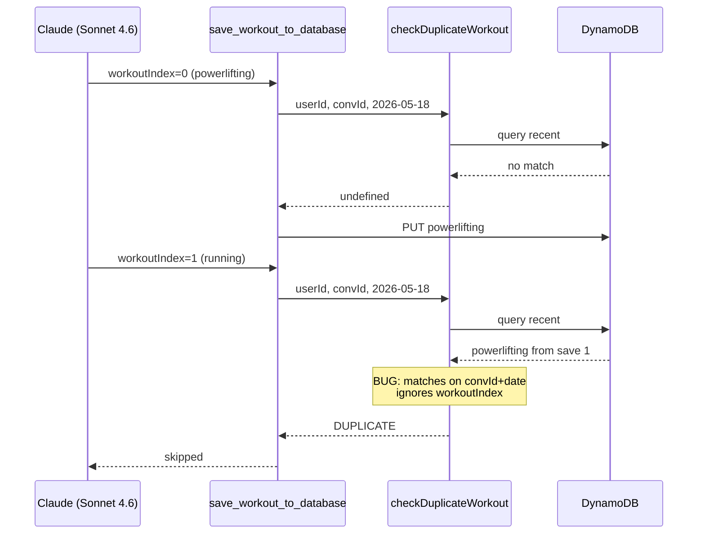

# Multi-Workout Duplicate-Detection Fix

**Status:** Implemented on `feature/agent-v2-coach-creator-tuning`
**Related Files:** `amplify/functions/libs/workout/data-utils.ts`, `amplify/functions/libs/agents/workout-logger/tools.ts`, `amplify/functions/libs/workout/data-utils.test.ts`
**Problem Date:** 2026-05-18
**Predecessor:** Commit `54f84aab` — `fix(agent-v2): forward index arg in legacy-adapter getToolResult`

---

## 1. Problem

After the `legacy-adapter` `getToolResult` index-forwarding fix (commit `54f84aab`) shipped on `feature/agent-v2-coach-creator-tuning`, the 2026-05-18 sandbox re-run of the three previously-failing integration tests showed:

| Test                                  | Result | Note                                                                                  |
| ------------------------------------- | ------ | ------------------------------------------------------------------------------------- |
| `multi-workout-two-sessions`          | PASS   | But only by accident — the model resolved "this evening" to the previous UTC day      |
| `crossfit-chipper-with-image`         | PASS   | PNG rename resolved the Bedrock format mismatch                                       |
| `multi-workout-strength-and-cardio`   | FAIL   | Save #2 (`Cursus Levis` / running) rejected as a duplicate of save #1 (powerlifting)  |

The cross-talk bug we fixed yesterday was masking a second, pre-existing bug. Now that distinct sibling saves actually reach the idempotency check, every multi-workout flow where two siblings share a UTC date trips it.

### Smoking gun (CloudWatch)

From `test/fixtures/test-workouts-20260518/cloudwatch-buildworkout.txt`:

```
2026-05-18T11:21:25.279Z  WARN  ⚠️ save_workout_to_database skipped — duplicate workout exists {
  conversationId: 'conv_test_multi-workout-strength-and-cardio_1779103215569_vbq17y',
  completedAt: '2026-05-18',
  templateId: undefined,
  existingWorkoutId: 'workout_..._1779103248096_q0atgzb0h',  ← powerlifting (save 1)
  attemptedWorkoutId: 'workout_..._1779103262414_b6tnypj0d'  ← running (save 2)
}
```

`multi-workout-two-sessions` happened to pass because the model resolved "this morning" → `2026-05-18T11:18:40Z` and "this evening" → `2026-05-17T03:00:00Z` (a previous UTC day). The date mismatch made the dup check miss save #1. That's a timezone-extraction coincidence, not a fix.

---

## 2. Root Cause

`checkDuplicateWorkout` in `amplify/functions/libs/workout/data-utils.ts` was designed under a one-workout-per-conversation-per-day assumption. Its fallback strategy matches on `(userId, conversationId, dateOnly)`:

```ts
// data-utils.ts:51-55 (pre-fix)
return recentWorkouts.find(
  (w) =>
    w.conversationId === conversationId &&
    new Date(w.completedAt).toISOString().split("T")[0] === dateOnly,
);
```

That was the right key when one Lambda invocation produced at most one workout. Multi-workout flows now legitimately produce N siblings sharing those three fields. The model signals sibling intent via `workoutIndex` on every save call (0, 1, 2, ...), but the dup check has no way to read it.

Template-scoped dedup (lines 33-37) is orthogonal — template links are precise and stay correct.



---

## 3. Fix

Add an optional `workoutIndex?: number` parameter to `checkDuplicateWorkout` and short-circuit the conversationId-fallback branch when `workoutIndex > 0`. The model has explicitly declared "this is sibling N, not a duplicate" via that input.

### Why `workoutIndex > 0` and not `> -1`?

The first sibling save in a multi-workout flow carries `workoutIndex=0`. At that point no sibling has been persisted yet, so the dup check is still meaningful — it catches genuine pre-existing duplicates from Lambda retries or double-submits. Only `workoutIndex > 0` is an unambiguous declaration of "this is the Nth distinct workout in a sibling batch."

### Why not check the result store directly?

A more general approach would be: "if this run has already persisted at least one sibling, skip the conversationId-fallback." That removes the dependency on the model emitting `workoutIndex` consistently. But:

- The `legacy-adapter` injected `getToolResult` (post-`54f84aab`) only exposes single-result reads, not `getAllToolResults`. Adding the latter is a broader framework change.
- The model is already emitting `workoutIndex` on every multi-workout save call — that's verified in the 2026-05-17 and 2026-05-18 CloudWatch traces.

So `workoutIndex` is the smallest, most localized signal that resolves the failure. If model behavior ever drifts and stops emitting reliable indices, we can revisit with a store-driven check.

### Files touched

#### `amplify/functions/libs/workout/data-utils.ts`

Add `workoutIndex` parameter and short-circuit branch (between template-scoped and conversation-fallback):

```ts
export async function checkDuplicateWorkout(
  userId: string,
  conversationId: string,
  completedAtDate: string | Date,
  templateId?: string,
  workoutIndex?: number,
): Promise<any | undefined> {
  try {
    if (templateId) {
      // Strategy 1: template-scoped dedup (unchanged)
      ...
    }

    // Multi-workout sibling save: the model has explicitly told us this is
    // the Nth distinct workout (N > 0). Skip the conversationId-fallback.
    if (typeof workoutIndex === "number" && workoutIndex > 0) {
      return undefined;
    }

    // Strategy 2: conversation + date dedup (unchanged)
    ...
  }
}
```

#### `amplify/functions/libs/agents/workout-logger/tools.ts`

Pass `workoutIndex` (already destructured at line 1164 from `input`) through to `checkDuplicateWorkout`:

```ts
const duplicate = await checkDuplicateWorkout(
  context.userId,
  context.conversationId,
  completedAtDate,
  context.templateContext?.templateId,
  workoutIndex,
);
```

#### `amplify/functions/libs/workout/data-utils.test.ts`

Four new tests covering all four branches:

1. `workoutIndex > 0` → returns undefined, doesn't even query DDB
2. `workoutIndex === 0` → conversationId-fallback still fires
3. `workoutIndex` undefined → conversationId-fallback still fires (single-workout backward compat)
4. `templateId` set → template-scoped dedup always wins, regardless of `workoutIndex`

---

## 4. Validation

### Unit

```bash
npx vitest run
```

All 660+ tests must pass, plus the 4 new tests in `data-utils.test.ts`.

### Integration (sandbox, post-deploy)

```bash
npx tsx test/integration/test-build-workout.ts \
  --test=multi-workout-two-sessions,multi-workout-strength-and-cardio,crossfit-chipper-with-image \
  --output=test/fixtures/test-workouts-$(date +%Y%m%d) \
  --verbose
```

**Expected outcome:** 3 / 3 pass, both multi-workout tests show distinct `workoutId`s for both siblings in DynamoDB, no `⚠️ save_workout_to_database skipped — duplicate workout exists` warnings in CloudWatch.

### Backward-compat spot-check

Single-workout tests (e.g. `simple-slash-command`, `crossfit-fran`) should still pass — they don't set `workoutIndex` on their save call, so they hit the unchanged conversationId-fallback branch.

---

## 5. Risk Assessment

- **Backward-compatible signature change** — the new arg is optional and defaults to `undefined`; existing callers compile unchanged.
- **Single call site in production** — only the workout-logger save tool calls `checkDuplicateWorkout`; the only other reference is the test file. Verified via grep before drafting.
- **Template-scoped dedup is untouched** — the precise mode for program-prescribed workouts is unaffected.
- **Single-workout flow is untouched** — undefined `workoutIndex` falls through to the original conversationId-fallback.
- **No new DDB calls** — the change actually *removes* a DDB query for sibling saves (small cost win).

### Rollback

Revert the `data-utils.ts` and `tools.ts` changes; the test additions are harmless on their own. The previous commit `54f84aab` (legacy-adapter fix) stays — that one is independently correct and shouldn't be rolled back regardless.

---

## 6. Open Questions / Follow-ups

- **Image format extension-vs-magic-bytes mismatch** — `getImageFormat` in `amplify/functions/libs/streaming/multimodal-helpers.ts:59-69` still trusts the file extension. The `IMG_9431.jpg → IMG_9431.png` fixture rename worked around it for the test, but a user uploading an iOS screenshot saved with the wrong extension would still hit a Bedrock rejection. Not blocking; worth a separate ticket.

- **Multi-workout post-save fan-out** — when both sibling saves succeed, two `build-exercise` and two `build-workout-analysis` Lambdas fire (one per sibling). That's correct, but worth confirming downstream consumers handle parallel arrivals for the same `conversationId` cleanly. Spot-check on first production multi-workout traffic.

---

## 7. Follow-up Fix: Workout-Level Qualitative Promotion (2026-05-18)

**Problem.** The 2026-05-18 sandbox re-run (post multi-workout dedup fix) revealed a separate validator logic gap in the `crossfit-chipper-with-image` test. The flow:

1. `classifyWorkoutCharacteristics` runs first and reports the *discipline* as quantitative (CrossFit defaults that way).
2. `determineBlockingFlags` builds the strict-block list, which includes `no_performance_data`. The extracted workout (image-only chipper with WHOOP data but no precise sets/reps) trips that flag.
3. `validateExerciseStructure` then runs and recognizes *this specific instance* as workout-level qualitative — `validateQualitativeWorkout` affirms it's valid.
4. **Bug:** that workout-level signal is just logged. `no_performance_data` stays in the blocking flags, the workout is rejected with `"No performance data found for strength/power workout"`, even though the qualitative validator already approved it.

This was not a regression from the multi-workout work — it's a pre-existing gap, exposed by model output variance for sparse image-only inputs.

**Fix.** In `validateWorkoutCompletenessTool.execute` (`amplify/functions/libs/agents/workout-logger/tools.ts`), after `validateExerciseStructure` returns:

- If `exerciseValidation.isQualitative === true`, filter `no_performance_data` out of `detectedBlockingFlags` and recompute `hasBlockingFlag`.
- Pass `effectiveIsQualitative = isQualitativeDiscipline || !!exerciseValidation.isQualitative` to `buildBlockingReason` so reason copy stays coherent on remaining flags.
- Only `no_performance_data` is stripped. Intent-based flags (`planning_inquiry`, `advice_seeking`, `future_planning`) must continue to block regardless of qualitative classification — they reflect user intent, not data shape.

**Risk.** Low. The promotion only relaxes a flag that `validateQualitativeWorkout` has *already* affirmed is valid (`validation-helpers.ts:366-384`) — we're propagating a signal that was being dropped, not bypassing validation.

**Tests.** Five new orchestration-level tests in `amplify/functions/libs/agents/workout-logger/tools.test.ts`:

1. Quantitative discipline + workout-level qualitative → `no_performance_data` cleared, save proceeds.
2. Quantitative discipline + workout-level NOT qualitative → flag remains, save blocked (unchanged).
3. Quantitative discipline + workout-level qualitative + `planning_inquiry` present → `planning_inquiry` still blocks.
4. Qualitative discipline (no-op path) → promotion does nothing.
5. Defensive: `exerciseValidation.isQualitative === undefined` is treated as false.

**Integration validation.** Re-run the same three-test sandbox set after deploy:

```bash
npx tsx test/integration/test-build-workout.ts \
  --test=multi-workout-two-sessions,multi-workout-strength-and-cardio,crossfit-chipper-with-image \
  --output=test/fixtures/test-workouts-$(date +%Y%m%d) \
  --verbose
```

Expected: 3 / 3 pass. `crossfit-chipper-with-image` saves successfully with `validationFlags` containing `no_performance_data` but `blockingFlags` empty (or at least without `no_performance_data`).
